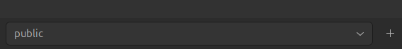
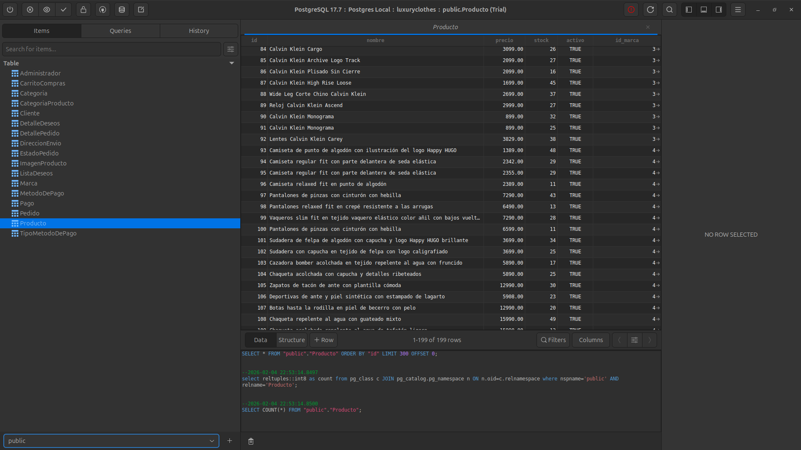

# CARPETA PARA ARCHIVOS SQL

Para poder levantar la base de datos localmente seguir los siguientes pasos.

1. Tener fuera de la carpeta del proyecto next (fuera de `luxury-clothes/`), en una carpeta muy a parte la siguiente estructura:

    ```bash
    project/
    ├── docker-compose.yml
    └── db/
        ├── init.sql
        └── data.sql
    ```

    El archivo `init.sql` y `data.sql` están ubicados en la carpeta `luxury-clothes/database/` al igual que el `docker-compose.yml`.

2. Levantar el contenedor posicionandose en la carpeta `project/`:

    ```bash
    docker compose up -d
    ```

3. Una vez levantado el contenedor, ejecutar el siguiente comando para entrar al contenedor de postgres:

    ```bash
    docker exec -it postgres_local psql -U postgres -d luxuryclothes
    ```

4. Estando dentro, ingresar lo siguiente y dar 'enter':

    ```bash
    \dt
    ```
    
    Para verificar que las tablas se encuentran definidas dentro del contenedor. Si no aparece nada algo salió mal, pero según todo está bien.

5. Salir del contenedor pulsando `ctrl + d` y ejecutar el siguiente comando estando en la carpeta `project/` para añadir los datos a las tablas.

    ```bash
    docker exec -i postgres_local \
    psql -U postgres -d luxuryclothes < db/data.sql
    ```

    La salida será la siguiente:

    ```bash
    INSERT 0 38
    INSERT 0 10
    INSERT 0 199
    INSERT 0 796
    INSERT 0 8
    INSERT 0 930
    ```


## Para visualizar las tablas y datos con tableplus realizar lo siguiente

1. Instalación de table plus:

    ```bash
    # Add TablePlus gpg key
    wget -qO - https://deb.tableplus.com/apt.tableplus.com.gpg.key | gpg --dearmor | sudo tee /etc/apt/trusted.gpg.d/tableplus-archive.gpg > /dev/null

    # Add TablePlus repo
    sudo add-apt-repository "deb [arch=amd64] https://deb.tableplus.com/debian/24 tableplus main"

    # Install
    sudo apt update
    sudo apt install tableplus
    ```


2. Teniendo TablePlus instalado, abrirlo, es un elefantito.

3. Clic en `Create a new connection`

4. Elegir `PostgreSQL`.

5. Llenar los datos de la conexión de la siguiente manera y clic en `Test` si sale todo bien dar en `Save` y posteriormente `Connnect`:

    


6. Una vez dentro se van a ver muchas cosas sin sentido. Cambiar la opción del menu en la esquina inferior izquierda a `public`.

    


7. Debería verse las tablas y cada una con sus datos. No todas están llenas, solo las que son estáticas como Producto, Categoria, etc.

    


